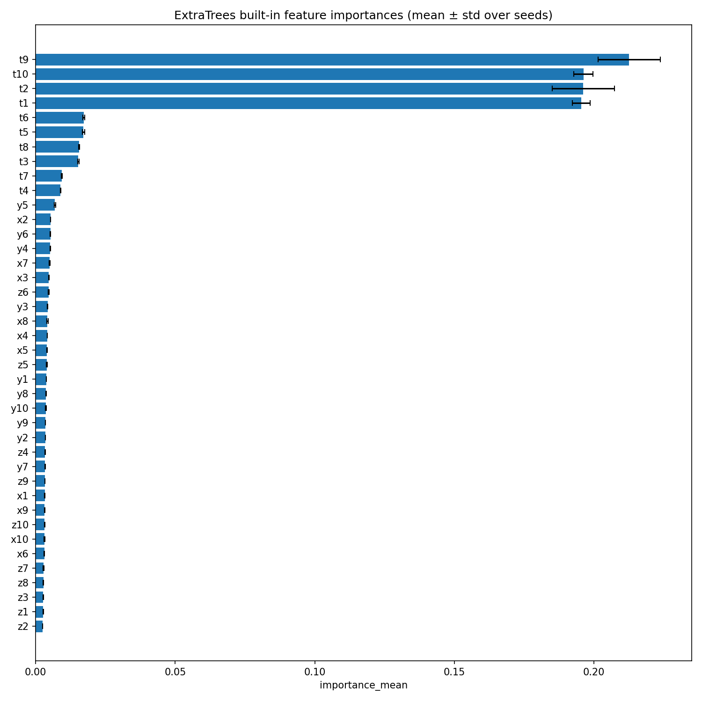

# Predicting Optimization Outputs — Multi-Model Surrogate Modeling Suite

> Replace a computational optimization algorithm with fast learned surrogates (classical ML, MLP, Transformer, sequential models).
> This repo contains preprocessing, training, reproducible multi-seed experiments, and teacher-forced vs autoregressive rollout evaluation.

---

## Table of contents

- [Overview](#overview)  
- [Data & Preprocessing](#data--preprocessing)  
- [Models Evaluated](#models-evaluated)  
- [Training & Evaluation Protocol](#training--evaluation-protocol)  
- [Results (summary tables)](#results-summary-tables)  
- [Results Visualization (plotting code)](#results-visualization-plotting-code)  
- [Reproducibility & File Structure](#reproducibility--file-structure)  
- [Future work](#future-work)  
- [Author](#author)

---

## Overview

This project learns surrogate models that predict the output of an optimization routine used in device-to-device communication problems. Each example contains features for `N` nodes (location and other per-node features) and an optimization output per node. The goal is to predict these outputs directly using ML models — dramatically faster than running the optimizer at inference time.

---

## Data & Preprocessing

- Raw logs are processed by `process_log_file(...)` into per-run CSVs saved under:

- Each processed CSV contains 100 temporally ordered samples (`sample_id` 0..99). Each sample contains:
- `x1..xN`, `y1..yN`, `z1..zN`, `t1..tN` — node features
- `output1..outputN` — optimization outputs (labels)
- `result1..resultN` — optional metadata
- Temporal split by run:
- Train: `t = 0..79`
- Val: `t = 80..89`
- Test: `t = 90..99`
- Features are scaled with `StandardScaler` fit on training data only. Targets are scaled for neural models.

---

## Models evaluated

We run a diverse set:

1. **Classical / scikit-learn models** (multi-output wrappers):
 - Linear Regression, Ridge, ElasticNet, SVR, KNN, Random Forest, Extra Trees, Gradient Boosting, scikit-learn MLP.

2. **Deep feedforward (PyTorch)**:
 - `DeepMLP` — fully connected network.

3. **Tabular Transformer (PyTorch)**:
 - `TabularTransformer` — projects flattened features to embedding → Transformer encoder → output head (tabular, non-sequential).

4. **Sequential models (PyTorch)**:
 - `LSTMRegressor` — uses past `window_size` timesteps (and previous outputs) to predict current outputs.
 - `TransformerRegressor` (temporal) — sequence encoder predicting current outputs.

---

## Training & evaluation protocol

- Loss: MSE; optimizer: Adam.
- Early stopping on validation loss (patience configurable).
- Multiple random seeds: experiments are repeated and **results reported as mean ± std** across seeds.
- Two evaluation modes for sequential models:
- **Teacher-forced**: model sees true previous outputs (one-step quality).
- **Autoregressive (rollout)**: model uses its own predictions recursively for `t=90..99`. We report per-horizon metrics for each forecast step and a final aggregated metric over `t=90..99`.

Metrics computed:
- MSE, RMSE, MAE, R².

---

## Results — summary tables

> The following tables are produced from the pipeline CSV outputs and reflect the exact results you supplied.

### Classical / shallow models (test metrics extracted & shown)

| Model | seed_mean | seed_std | test_mse_mean | test_mse_std | test_rmse_mean | test_rmse_std | test_mae_mean | test_mae_std | test_r2_mean | test_r2_std |
|---|---:|---:|---:|---:|---:|---:|---:|---:|---:|---:|
| ElasticNet | 555.25 | 980.6917 | 0.0263620 | 0.0 | 0.162364 | 0.0 | 0.110436 | 0.0 | 0.442246 | 0.0 |
| Extra Trees | 555.25 | 980.6917 | 0.0228661 | 0.0002220 | 0.151214 | 0.0007345 | 0.0887817 | 0.0006557 | 0.455029 | 0.0090690 |
| Gradient Boosting | 555.25 | 980.6917 | 0.0248556 | 0.0000904 | 0.157656 | 0.0002869 | 0.0940865 | 0.0001784 | 0.401984 | 0.0042282 |
| K-Nearest Neighbors | 555.25 | 980.6917 | 0.107776 | 0.0 | 0.328292 | 0.0 | 0.223452 | 0.0 | -0.032898 | 0.0 |
| Linear Regression | 555.25 | 980.6917 | 0.038016 | 0.0 | 0.194977 | 0.0 | 0.133915 | 0.0 | 0.069191 | 0.0 |
| Random Forest | 555.25 | 980.6917 | 0.0259922 | 0.0006021 | 0.161213 | 0.0018672 | 0.0956510 | 0.0011032 | 0.350006 | 0.0221787 |
| Ridge Regression | 555.25 | 980.6917 | 0.0361142 | 0.0 | 0.190037 | 0.0 | 0.130222 | 0.0 | 0.121205 | 0.0 |
| Support Vector Regression | 555.25 | 980.6917 | 0.0384303 | 0.0 | 0.196037 | 0.0 | 0.138159 | 0.0 | 0.341899 | 0.0 |

---

### DeepMLP (averaged across seeds you ran)

| Dataset | MSE mean | MSE std | RMSE mean | RMSE std | MAE mean | MAE std | R² mean | R² std | n_seeds |
|---|---:|---:|---:|---:|---:|---:|---:|---:|---:|
| Train | 0.0047855 | 0.0006854 | 0.0690345 | 0.0051347 | 0.0496965 | 0.0036727 | 0.9525925 | 0.0070069 | 4 |
| Val | 0.0278394 | 0.0018233 | 0.1667852 | 0.0054220 | 0.1070630 | 0.0048599 | 0.3984685 | 0.0365596 | 4 |
| Test | 0.0327266 | 0.0015311 | 0.1808674 | 0.0042502 | 0.1276997 | 0.0036299 | 0.4328009 | 0.0147267 | 4 |

---

### Sequential models (teacher-forced evaluation shown; rollout metrics produced separately)

| Model | Dataset | MSE | RMSE | MAE | R² |
|---|---:|---:|---:|---:|---:|
| LSTM | Train | 0.1166289 | 0.3415097 | 0.2363385 | 0.2161138 |
| LSTM | Val | 0.1318378 | 0.3630948 | 0.2446303 | 0.0235796 |
| LSTM | Test | 0.1451205 | 0.3809468 | 0.2628478 | 0.0845345 |
| Transformer (seq) | Train | 0.0011084 | 0.0332931 | 0.0237496 | 0.9903989 |
| Transformer (seq) | Val | 0.0213441 | 0.1460964 | 0.0875493 | 0.4840492 |
| Transformer (seq) | Test | 0.0263884 | 0.1624452 | 0.1096441 | 0.5421917 |

> Note: For sequential models we also compute **per-horizon teacher vs rollout** metrics stored in:
> - `sequential_rollout_per_horizon_LSTM.csv`
> - `sequential_rollout_per_horizon_Transformer.csv`  
> Final aggregated rollout summaries are saved in:
> - `sequential_rollout_summary_LSTM.csv`
> - `sequential_rollout_summary_Transformer.csv`

---

## Feature importance figures

The feature importance analysis produced and saved the following visualizations (in `results_feature_importance/`):

### Built-in ExtraTrees importances (mean ± std over seeds)

[//]: # (### Permutation importance: average increase in MSE when a feature is permuted &#40;mean ± std over seeds&#41;)

[//]: # (![Permutation importance]&#40;results_feature_importance/permutation_importance.png&#41;)

[//]: # ()
[//]: # (### SHAP summary &#40;optional&#41;)

[//]: # (![SHAP summary]&#40;results_feature_importance/shap_summary.png&#41;)

